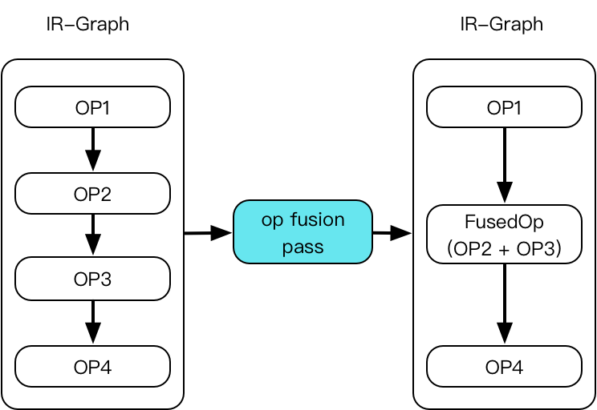
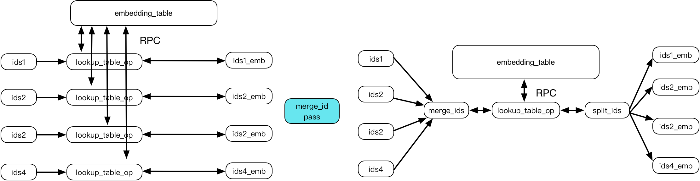
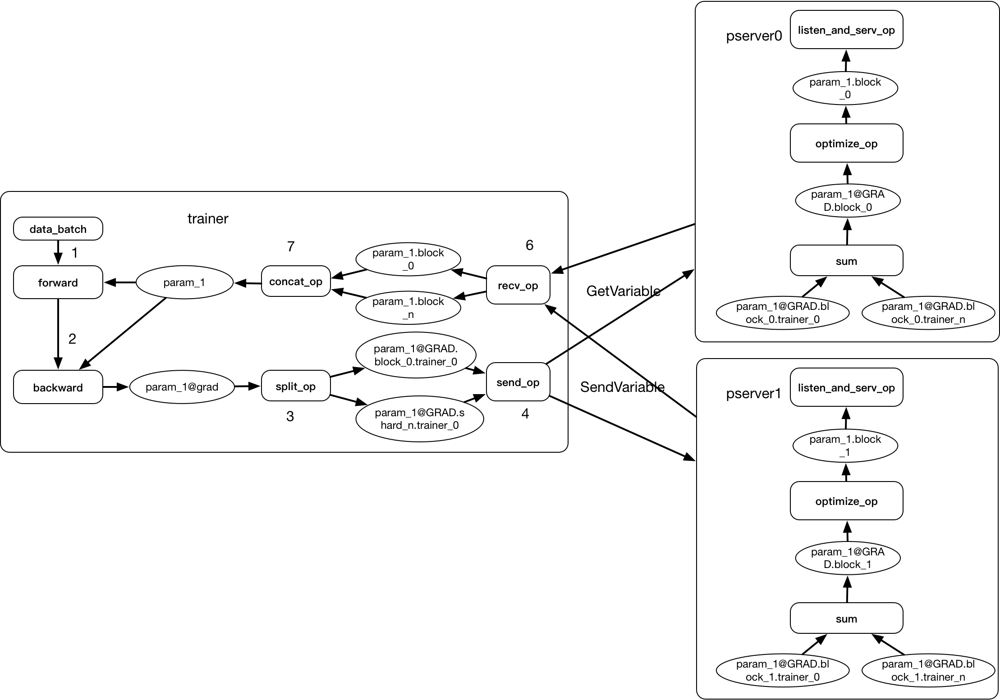

# Paddle大规模分布式训练深度解析
PaddlePaddle是百度开源的一款深度学习框架，为了满足百度在深度学习领域的前沿探索和工业级深度学习应用场景，paddle不仅支持灵活的深度学习建模和组网，以便用户能建模各种复杂的深度网络模型结构，例如CNN/RNN/GAN/RL等，更能支持互联网规模的深度学习应用，例如用数百台服务器在短时间内训练一个面向数亿用户的推荐模型并上线提供服务。

本文以一个常见的点击率预估(CTR)模型为例，来介绍paddle如何将灵活的组网能力，基于统一中间表达IR-Graph优化能力的和高效的工业级大规模模型训练能力结合，提供一个能适应各种场景应用的深度学习框架。目前大规模分布式训练分CPU和GPU两种场景，需要解决的问题不太一样，本文主要介绍大规模CPU分布式训练的一些优化。

## 问题背景
在互联网场景中，例如搜索和推荐系统，亿级的用户每天产生着百亿级的用户数据。如何利用这些数据训练出更好的模型来给用户提供服务，对机器学习框架提出了很高的要求。

- 样本数量大。单周20T+ 
- 特征维度多。千亿甚至万亿
- 参数大。T级别
- 时效要求高。小时级更新
 
 
Paddle框架将深度学习任务分为两个阶段：CompileTime和RunTime，在两个阶段都会对任务作出一些优化：

### Compile time Optimization:

Compile time Optimization主要对模型的逻辑结构进行优化，paddle中目前统一使用基于IR-Graph的表达，以及各种optimization-pass对齐进行优化，下面举几个例子：

- Op Fusion。随着深度学习模型越来越复杂，模型中的操作粒度越来越小，模型中包含的操作Operator的数量也越来越多，这么多的op会带来额外的调度开销和中间变量内存消耗，而在paddle基于IR-Graph的优化中，有一些优化pass会将常见的一起出现的多个op fuse成一个粒度更大但速度更快更节约内存的节点，而无需用户手动配置。

  
- RPC-Fusion。在大规模分布式推荐模型中，一个主要的操作就是embedding，通常会有多个(几十到几百个)输入复用同一个比较大的embedding table，如下图左边所示，在分布式场景下，每个`embedding_lookup`操作都需要发起rpc请求去查询数据对应的参数，假设节点数为N，输入id数为M，那么每个parameter server收到的RPC个数为: `N * M`，会随着输入个数线性增长，每个trainer也需要调用M次`lookup_table_op`，对速度和性能都会有影响，通过`id-merge pass`将多个查表操作合并成一个，那么每个server收到的请求变成M，每个trainer也只需调用1次`lookup_table_op`即可，可以大大提高执行效率和通信效率。
 
  

 - In-Graph distribute traininig。worker和pserver之间同构，复用同样的基础设施(Operator/Optimizer/Regularizer/Executor)，这样能够保证单机和分布式逻辑保持一致，用户单机训练的模型能够无缝迁移到分布式环境中训练。
 
 同步训练架构图:
 
 

 

### Runtime Optimization:

- 多线程训练和调度: 训练服务器往往都有很多个CPU，为了充分发挥CPU的计算能力，需要使用多线程模式来训练。一个深度学习模型往往含有多个Operator，每个Operator都是一个最小的计算单位，为了充分利用CPU，需要尽量高并发的启动多个op，但是为了保证结果的正确性，需要分析出不同op之间的依赖关系，按照正确的顺序依次调度。

- 数据IO Pipeline：Python reader/异步Python Reader/multiprocess reader/C++ reader。当框架训练速度优化到很高的时候，数据输入就可能成为瓶颈，而为了数据处理的灵活性，一般数据reader都是用Python写的，这样训练速度就可能受限于Python读数据的速度，每次处理流程就是: Python读数据 => 送入框架 => 训练 
	
- Out-of-Graph distribute traininig。

- ### 模型部署

## Benchmark
数据分析：

 1. 训练速度加速比 吞吐
 1. 收敛速度加速比 
 1. 按节点数算CPU占用率

## 未来规划

基于paddle灵活的组网能力和强大的并行训练能力，paddle也提供了对推荐系统的完整支持，开源了CTR/GRU4Rec/Multiview-Simnet/SSR/tagspace等多种常用的推荐模型和完整的文档。
